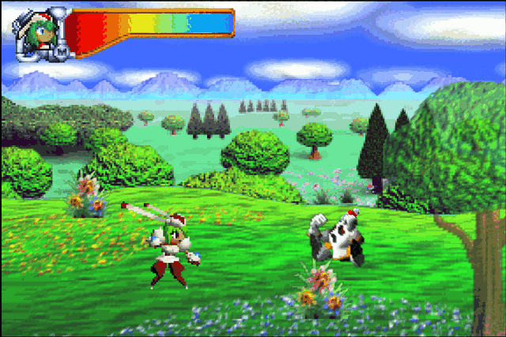
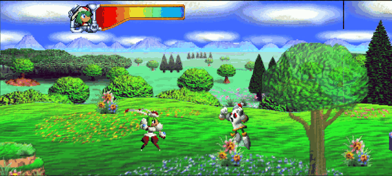
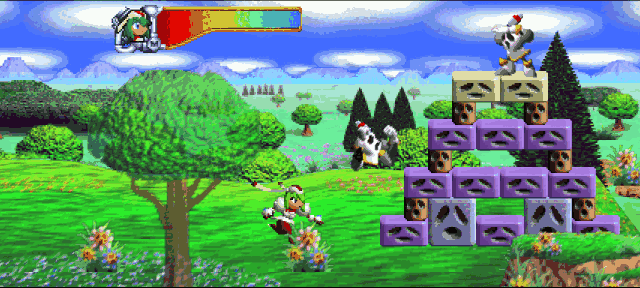
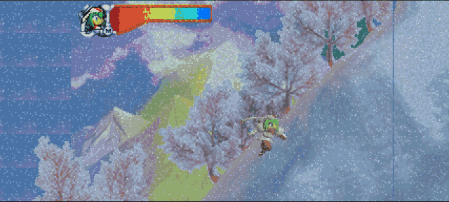
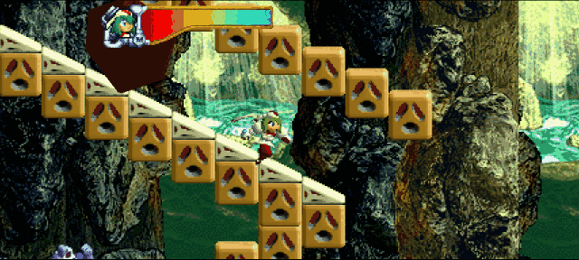
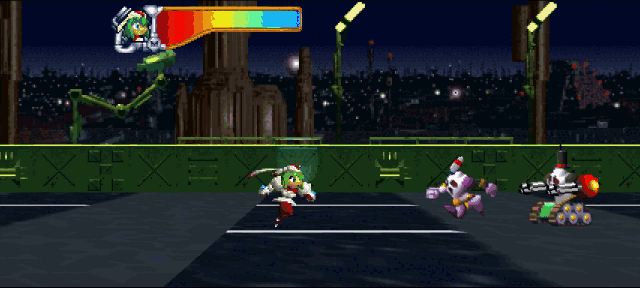
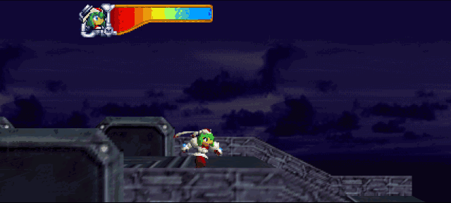

# Trouble Makers

Trouble Makers is a native PC port of the Nintendo 64 game *Mischief Makers*
(Treasure, 1997), produced by static recompilation — playable, 60 fps,
high-resolution, with correct sound and **widescreen support!**


<sub>Opening forest in opt-in widescreen — the whole 16:9 field is real rendered scene, not stretched or letterboxed.</sub>

## What this is

*Mischief Makers* is the original N64 game. **Trouble Makers** is a
recompilation of it: the game's own MIPS machine code is translated to C once,
ahead of time, by [N64Recomp](https://github.com/N64Recomp/N64Recomp),
compiled natively for your PC, and linked against
[N64ModernRuntime](https://github.com/N64Recomp/N64ModernRuntime) (a libultra
re-implementation) with [RT64](https://github.com/rt64/rt64) rendering the
display lists on Vulkan. It is not an emulator — there is no N64 CPU being
simulated at runtime; the game *is* the native binary. Same approach as
[Zelda64Recomp](https://github.com/Zelda64Recomp/Zelda64Recomp), applied to a
very different, very Treasure-shaped game.

The reverse-engineering work behind the port is captured here as a symbol and
section map. N64Recomp combines that map with your own ROM to translate the
game, so building this project does **not** require a separate decompilation
checkout.

**No game assets, ROM contents, or recompiler output are in this repository.**
Everything runs locally from your own legally dumped ROM.

## Download & play

Grab the latest build from the
[Releases page](https://github.com/ThiagoLira/trouble-makers-pc-recomp/releases):

- **Linux** — `TroubleMakers-x86_64.AppImage`. `chmod +x` it and run; needs a
  Vulkan-capable GPU and glibc ≥ 2.35 (Ubuntu 22.04+).
- **Windows** — `TroubleMakers-Windows-X64.zip`. Extract and run
  `troublemakers.exe`.

Then pick your own legally dumped **Mischief Makers (US 1.1)** ROM in the
launcher — it validates the ROM and remembers it for next time. Drop a
`portable.txt` next to the binary to keep saves and config beside it instead
of in your user config directory.

Prefer to build it yourself? See [Building and running](#building-and-running).

## Status

- ✅ Boots, plays the full intro with correct music, title screen, menus
- ✅ Gameplay: many levels verified playable (controller + keyboard)
- ✅ Natively 60 fps (the game's own rate), correct audio pacing
- ✅ High-resolution rendering (window-integer-scale via RT64), fullscreen, MSAA/SSAA
- ✅ EEPROM saves persist to disk
- ✅ Remappable keyboard/controller inputs with two bindings per N64 control
- ✅ Persistent current/previous session logs and copyable support reports
- 🧪 Experimental widescreen (opt-in), high-FPS frame interpolation
  (`--fps 240` / match display, opt-in via RT64), F11 fullscreen, Tab
  fast-forward, persistent display config
- 🧰 Launcher-gated, save-safe debug menu with campaign level warps
- 🗺️ Next: full-playthrough verification, mod hooks, upstreaming runtime patches

## Experimental widescreen

`--widescreen` expands playable scenes beyond the N64's original 4:3 frame.
This is real scene rendering: actors, 3D geometry, and the game's scrolling
background, environment, and midground tile maps can draw into both side
wings. It is still experimental while level-specific masks, framebuffer
effects, and off-map boundaries are tested across the full game.

| Original 4:3 (`--no-widescreen`) | Experimental 16:9 (`--widescreen`) |
|:--:|:--:|
|  |  |

Both GIFs were captured from this build in the first playable level at the
same idle sequence. Cinematics automatically use the original presentation;
the renderer reopens the wings only after stable player control is detected.

### Widescreen gallery

These live captures use the automated controller driver, so the camera,
actors, geometry, and tile layers are moving throughout each shot.

| Meet Marina | Snowstorm Maze |
|:--:|:--:|
|  |  |
| Rolling Rock | ClanCe War 2 |
|  |  |
| Trapped | More captures |
|  | Five more animated scenes are preserved in the [full widescreen gallery](screenshots/widescreen-gallery/README.md). |

## Building and running

### Prerequisites

- A legally dumped **Mischief Makers (US 1.1)** ROM (`.z64`, big-endian)
- Linux: GCC/G++ 12 or newer (C++20), CMake ≥ 3.24, SDL2, a Vulkan-capable GPU + loader
  (no Vulkan SDK needed — RT64 bundles headers and its shader compiler)
- Windows: Visual Studio 2022 with the "Desktop development with C++", "C++
  Clang Compiler" and "C++ CMake tools" components — build with **clang-cl**
  (`cmake -G Ninja -DCMAKE_C_COMPILER=clang-cl -DCMAKE_CXX_COMPILER=clang-cl`);
  MSVC's cl is not supported for the generated C. SDL2 is fetched
  automatically and SDL2.dll + the DXC DLLs are copied next to
  `troublemakers.exe`. Saves/config go to `%LOCALAPPDATA%\troublemakers-recomp`
  (or next to the exe with a `portable.txt`).

### One-time setup

```sh
git clone --recurse-submodules https://github.com/ThiagoLira/trouble-makers-pc-recomp
cd trouble-makers-pc-recomp

# Supply your own big-endian US 1.1 ROM. It is ignored by git and never copied
# into the resulting executable.
mkdir -p input
cp /path/to/your/mischief-makers-us-1.1.z64 input/troublemakers.us1.z64
echo "e00ab74c3dee79efaafe8e10f2a6b67784d7327ab588d8ef90ad8945427da627  input/troublemakers.us1.z64" | sha256sum -c -

# Runtime fixes not yet upstreamed (message delivery, overlay registration,
# EEPROM semantics):
git -C lib/N64ModernRuntime am "$(pwd)"/patches/N64ModernRuntime/*.patch

# RT64 (renderer), pinned to the fork/commit Zelda64Recomp uses, plus the
# local rendering fixes:
git clone https://github.com/rt64/rt64 lib/rt64
git -C lib/rt64 checkout 23cab603
git -C lib/rt64 submodule update --init --recursive
git -C lib/rt64 apply "$(pwd)"/patches/rt64/*.patch

# Translate the game and audio microcode directly from your ROM, using the
# symbol/section map checked into this repository:
cmake -B tools/N64Recomp/build tools/N64Recomp
cmake --build tools/N64Recomp/build --target N64RecompCLI RSPRecomp -j
tools/N64Recomp/build/N64Recomp troublemakers.us1.toml
tools/N64Recomp/build/RSPRecomp aspMain.us1.rsp.toml
```

### Build and play

```sh
cmake -B build -DCMAKE_BUILD_TYPE=Release
cmake --build build --target troublemakers -j8

./build/src/game/troublemakers                                 # no args: launcher
#   (launcher: pick your ROM, configure display and controls, copy support logs,
#   then Start Game; settings and the validated ROM are remembered)
./build/src/game/troublemakers path/to/your.z64                # windowed 1280x960
./build/src/game/troublemakers rom.z64 --fullscreen
./build/src/game/troublemakers rom.z64 --window 1920x1440 --msaa 4
./build/src/game/troublemakers rom.z64 --fps 240      # RT64 frame interpolation:
#   smoother-than-60 motion synthesized between the game's native 60Hz frames
#   (game logic still runs at 60Hz). Use --fps display to match your monitor.
./build/src/game/troublemakers rom.z64 --widescreen    # real 16:9 scene rendering:
#   entities, foreground, scrolling backdrops, environment and midground
#   tile maps are drawn beyond the original 4:3 frame. Plain launches retain
#   the original presentation.
./build/src/game/troublemakers rom.z64 --no-widescreen # force original 4:3
./build/src/game/troublemakers rom.z64 --debug-menu     # enable debug overlay
```

Widescreen uses the game's own wrapping maps and scene formulas—there is no
mirroring, stretching, blur fill, or other cosmetic substitute. Every layer
in ordinary scrolling scenes is eligible to extend; individual off-frame
tiles whose art a scene never loads are validated against the loaded texture
bank and left at a clean authored boundary instead of displaying uninitialized
texture memory.
Entity spawn/despawn windows are widened to match, so objects no longer pop
in at the wing edges.
Opening/in-stage cinematics automatically switch back to centered 4:3 and
return to widescreen only after player control is stable. NPC conversations
during gameplay remain widescreen. A small remaining fallback set currently
stays 4:3 while its fixed-canvas composition is being validated (scenes 25,
27, 57, 71, 79, and 85). Vertigo and Seasick Climb now render their rotating
textured walls in widescreen without framebuffer trails.
See the live [scene 22 capture](screenshots/widescreen-scene-22.png), the
[forest artifact comparison](screenshots/widescreen-forest-fix.png), and the
labeled [coverage](screenshots/widescreen-coverage-scenes.png) and
[regression](screenshots/widescreen-regression-scenes.png) sheets. The final
[playable-level sample](screenshots/widescreen-playable-suite.png) and
[4:3 cinematic sample](screenshots/widescreen-cutscenes-4x3.png) show the
automatic mode boundary.

Run the complete playable-level screenshot/crash suite with:

```sh
tools/test_widescreen_playable.sh ./build/src/game/troublemakers path/to/rom.z64 /tmp/mm-widescreen-suite
```

On KDE Wayland, set `MM_VIDEO_DRIVER=wayland`; the suite uses Spectacle for
native active-window captures instead of X11/XWayland window IDs.

The suite targets exact progression-table stage indices, advances dialogue,
waits for authoritative player-control state, moves Marina in short alternating
bursts, audits expanded tile layers for wing coverage, and writes a TSV manifest
plus a multi-frame contact sheet and log for every level. For transient 3D
problems, capture a sustained frame sequence with `tools/test_render_burst.sh`.

Display options persist to `display.cfg` and input mappings to `controls.json`
in the app config folder (CLI display options override the file). In game:
**F11** toggles fullscreen, **hold Tab** fast-forwards 3x.

The launcher's **Enable debug menu** option enables an in-game overlay. Press
**F1** or controller **L+R+Start** to open it; use Up/Down and Enter (or
the D-pad and A) to select one of the 52 campaign stages. Left/Right switches
pages and Esc/B closes it. Gameplay input is held while the overlay is open.
The first debug warp disables all save-buffer mutations
until the process exits, while reads continue to use the save loaded at
startup, so debug progression cannot overwrite the player's save file.

The launcher also exposes MSAA and SSAA. MSAA 4x is the recommended first
choice: it smooths geometry edges at much lower cost than supersampling. SSAA
2x renders above the automatic internal resolution and downsamples the result;
it also smooths shader and texture edges, but uses roughly four times the
rendering pixels before widescreen expansion. To prevent oversized render
targets and GPU-memory crashes, MSAA and SSAA are mutually exclusive, SSAA is
capped at 2x, and MSAA is capped at 4x. Frame interpolation can be combined
with either antialiasing method. See [Known Issues](KNOWN_ISSUES.md) for the
current sprite-interpolation and terrain-strip limitations.

The ROM is hash-validated (US 1.1 only), stored under
`~/.config/troublemakers-recomp/` along with saves, and the game auto-starts.
The scene renders at window-integer-scale: a bigger window IS higher internal
resolution. Keep the window visible — a fully occluded window pauses the
present and the game with it.

### AppImage

```sh
./.github/linux/appimage.sh          # after building troublemakers; NO_STRIP=1 on Arch-likes
```

Produces `TroubleMakers-x86_64.AppImage` (launcher included — no
CLI needed; the ROM is picked in the splash screen). Build it on the oldest
distro you want to support: the AppImage requires the build machine's glibc
or newer. Put a `portable.txt` next to the AppImage to keep config/saves in
that folder instead of `~/.config/troublemakers-recomp`.

On Linux, NVIDIA 610-series and newer drivers automatically use RT64's
ubershader path to avoid a driver-specific corruption of text and sprites.
Set `MM_RT64_UBERSHADERS_ONLY=1` to force that path when diagnosing a similar
problem, or `MM_RT64_UBERSHADERS_ONLY=0` to disable the workaround.

CI (`.github/workflows/build.yml`) builds both the Linux AppImage and the
Windows package on every push and uploads them as artifacts. Release CI needs
a `TM_ASSETS_REPO` secret pointing at a private repo containing
`troublemakers.us1.z64`; public builders only need their own ROM and do not
need access to that private repo.

**Cutting a release** is one command — push a version tag and CI builds both
platforms and publishes a prerelease with the artifacts attached and
auto-generated notes:

```sh
git tag v0.3.0 && git push origin v0.3.0
```

### Controls

Open the launcher's **Controls** tab to remap either keyboard or controller
inputs. Every logical N64 input has two simultaneous binding slots. Controller
buttons, triggers, and either direction of an analog axis can be assigned;
each row can be cleared or reset, and **Reset all** restores the recomp
defaults. Changes are saved immediately to the versioned, human-readable
`controls.json` file.

| N64        | Default keyboard | Default controller |
|------------|------------------|--------------------|
| Stick      | W A S D          | Left stick         |
| D-pad      | Arrow keys       | D-pad              |
| A / B      | X / C            | South / West face  |
| Z / L / R  | Left Shift / Q / E | LT / LB / RT    |
| C-buttons  | I J K L          | Right stick        |
| Start      | Enter            | Start              |

The first SDL game controller is picked up automatically and hotplugged
(rumble included). C-buttons also have convenient secondary face/shoulder
bindings by default.
When enabled in the launcher, the debug overlay uses **F1** or controller
**L+R+Start**.

### Logs and bug reports

All stdout/stderr diagnostics from the recomp, SDL, runtime, and renderer are
captured under the app config folder:

- Linux: `~/.config/troublemakers-recomp/`
- Windows: `%LOCALAPPDATA%\troublemakers-recomp\`
- Portable mode: beside the executable/AppImage

`logs/latest.log` is the active run and `logs/previous.log` is the run before
it. Logs are bounded to 512 KiB and retain a diagnostic header plus the newest
output.

For a crash or gameplay bug, reproduce it once, relaunch the game, open
**Support**, and choose **Copy previous session**. Paste that report into the
GitHub bug form; attach the full `previous.log` only when requested. The
copyable report is capped for GitHub, and its diagnostic header omits ROM and
home-directory paths. Skim it before posting because an operating-system or
third-party error may still quote a local path.

## How it works / hacking on it

Source layout: `src/game/` (host entry, overlay registration, OS shims),
`src/rsp/` (recompiled aspMain audio microcode + dispatch),
`src/graphics/` (RT64 renderer glue), `src/audio_input/` (SDL2 audio, input,
save config), `patches/` (runtime patches pending upstream), `tools/` (the
recompiler submodule + agent-workflow scripts).

The complete engineering history — twelve root-caused bugs from "parks before
boot" to "playable", every mission brief, and the debugging recipes — lives in
[`docs/`](docs/). It is written to
onboard an AI agent (or you) in one sitting. Headless dev harness:
`MM_HEADLESS_GFX=1` runs the full game loop with no GPU.

## Licensing

Copyright (C) 2026 Thiago Lira. This project is **GPLv3** (see `LICENSE`).

It statically links [`N64ModernRuntime`](https://github.com/N64Recomp/N64ModernRuntime),
which is GPLv3, so the combined work — including the binaries on the Releases
page — is a derivative work under GPLv3. This matches
[Zelda64Recomp](https://github.com/Zelda64Recomp/Zelda64Recomp), which is
GPLv3 for the same reason; the project cannot be distributed under a permissive
license like MIT.

- Some linked components carry their own permissive terms — `N64Recomp` and
  `RT64` are MIT — but the copyleft obligation from `N64ModernRuntime` governs
  the distributed whole.
- No Nintendo/Treasure code or assets are included or distributed.

## Credits

- [N64Recomp / N64ModernRuntime](https://github.com/N64Recomp) and
  [Zelda64Recomp](https://github.com/Zelda64Recomp/Zelda64Recomp) — the
  toolchain and the integration blueprint
- [RT64](https://github.com/rt64/rt64) — the renderer
- Treasure Co. Ltd — for the weirdest, most wonderful N64 game
