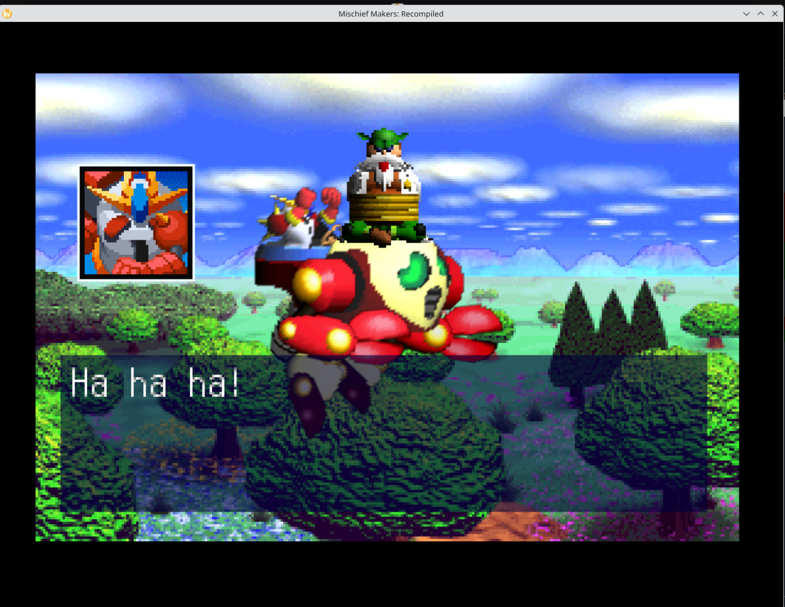

# Mischief Makers: Recompiled

**A native PC port of Mischief Makers (N64, 1997) via static recompilation —
playable, 60 fps, high-resolution, with correct sound.**



The whole game's MIPS code is translated to C once, ahead of time, by
[N64Recomp](https://github.com/N64Recomp/N64Recomp), compiled natively, and
linked against [N64ModernRuntime](https://github.com/N64Recomp/N64ModernRuntime)
(a libultra re-implementation) with [RT64](https://github.com/rt64/rt64)
rendering the display lists on Vulkan. Same approach as
[Zelda64Recomp](https://github.com/Zelda64Recomp/Zelda64Recomp); this project
covers a very different, very Treasure-shaped game.

Sibling project: [trouble-makers-ai-recomp](../trouble-makers-ai-recomp) — the
byte-perfect decompilation whose symbol-rich ELF makes this translation
legible (every function arrives named).

**No game assets, ROM contents, or recompiler output are in this repository.**
Everything runs locally from your own legally dumped ROM.

## Status

- ✅ Boots, plays the full intro with correct music, title screen, menus
- ✅ Gameplay: first level verified playable (controller + keyboard)
- ✅ Natively 60 fps (the game's own rate), correct audio pacing
- ✅ High-resolution rendering (window-integer-scale via RT64), fullscreen, MSAA/SSAA
- ✅ EEPROM saves persist to disk
- ✅ Widescreen (opt-in), F11 fullscreen, Tab fast-forward, persistent display config
- 🚧 Automated widescreen sweep passes all 52 playable progression rows;
  a full controller-driven playthrough is still pending. Window
  occlusion freezes the game (present-paced); minor dither artifacts remain in
  translucent overlays at high res.
- 🗺️ Next: full-playthrough verification, mod hooks, upstreaming runtime patches

## Building and running

### Prerequisites

- A legally dumped **Mischief Makers (US 1.1)** ROM (`.z64`, big-endian)
- The sibling decomp built once (its `./trouble build` produces `troublemakers.elf`)
- Linux: gcc/g++ (C++20), CMake ≥ 3.20, SDL2, a Vulkan-capable GPU + loader
  (no Vulkan SDK needed — RT64 bundles headers and its shader compiler)

### One-time setup

```sh
git clone --recurse-submodules https://github.com/ThiagoLira/trouble-makers-pc-recomp
cd trouble-makers-pc-recomp

# Runtime fixes not yet upstreamed (message delivery, overlay registration,
# EEPROM semantics):
git -C lib/N64ModernRuntime am "$(pwd)"/patches/N64ModernRuntime/*.patch

# RT64 (renderer), pinned to the fork/commit Zelda64Recomp uses, plus the
# widescreen wing-clear patch:
git clone https://github.com/rt64/rt64 lib/rt64
git -C lib/rt64 checkout 23cab603
git -C lib/rt64 submodule update --init --recursive
git -C lib/rt64 apply "$(pwd)"/patches/rt64/0001-widescreen-wing-clear.patch

# Translate the game + audio microcode:
cp ../trouble-makers-ai-recomp/build/troublemakers.elf input/
cmake -B tools/N64Recomp/build tools/N64Recomp
cmake --build tools/N64Recomp/build --target N64Recomp RSPRecomp -j
tools/N64Recomp/build/N64Recomp troublemakers.us1.toml
tools/N64Recomp/build/RSPRecomp aspMain.us1.rsp.toml
```

### Build and play

```sh
cmake -B build -DCMAKE_BUILD_TYPE=Release
cmake --build build --target mm_game -j8

./build/src/game/mm_game path/to/your.z64                # windowed 1280x960
./build/src/game/mm_game rom.z64 --fullscreen
./build/src/game/mm_game rom.z64 --window 1920x1440 --msaa 4
./build/src/game/mm_game rom.z64 --widescreen    # real 16:9 scene rendering:
#   entities, foreground, scrolling backdrops, environment and midground
#   tile maps are drawn beyond the original 4:3 frame. Plain launches retain
#   the original presentation.
```

Widescreen uses the game's own wrapping maps and scene formulas—there is no
mirroring, stretching, blur fill, or other cosmetic substitute. Every layer
extends in every scene; individual off-frame tiles whose art a scene never
loads are validated per-tile against the loaded texture bank and left at a
clean authored boundary instead of displaying uninitialized texture memory.
Entity spawn/despawn windows are widened to match, so objects no longer pop
in at the wing edges.
Opening/in-stage cinematics automatically switch back to centered 4:3 and
return to widescreen only after player control is stable. Three fixed-canvas
playable scenes (36, 57, and 71) also remain 4:3 by design.
See the live [scene 22 capture](screenshots/widescreen-scene-22.png), the
[forest artifact comparison](screenshots/widescreen-forest-fix.png), and the
labeled [coverage](screenshots/widescreen-coverage-scenes.png) and
[regression](screenshots/widescreen-regression-scenes.png) sheets. The final
[playable-level sample](screenshots/widescreen-playable-suite.png) and
[4:3 cinematic sample](screenshots/widescreen-cutscenes-4x3.png) show the
automatic mode boundary.

Run the complete playable-level screenshot/crash suite with:

```sh
tools/test_widescreen_playable.sh ./build/src/game/mm_game path/to/rom.z64 /tmp/mm-widescreen-suite
```

The suite targets exact progression-table stage indices, advances dialogue
through a test-only input pulse, waits for authoritative player-control state,
and writes a TSV manifest plus one screenshot/log per level.

Options persist to `~/.config/troublemakers-recomp/display.cfg` (CLI
overrides). In game: **F11** toggles fullscreen, **hold Tab** fast-forwards 3x.

The ROM is hash-validated (US 1.1 only), stored under
`~/.config/troublemakers-recomp/` along with saves, and the game auto-starts.
The scene renders at window-integer-scale: a bigger window IS higher internal
resolution. Keep the window visible — a fully occluded window pauses the
present and the game with it.

### Controls

| N64        | Key        | N64      | Key         |
|------------|------------|----------|-------------|
| Stick      | W A S D    | A        | X           |
| D-pad      | Arrows     | B        | C           |
| C-buttons  | I J K L    | Z        | Left Shift  |
| L / R      | Q / E      | Start    | Enter       |

The first SDL game controller is picked up automatically (rumble included).

## How it works / hacking on it

Source layout: `src/game/` (host entry, overlay registration, OS shims),
`src/rsp/` (recompiled aspMain audio microcode + dispatch),
`src/graphics/` (RT64 renderer glue), `src/audio_input/` (SDL2 audio, input,
save config), `patches/` (runtime patches pending upstream), `tools/` (the
recompiler submodule + agent-workflow scripts).

The complete engineering history — twelve root-caused bugs from "parks before
boot" to "playable", every mission brief, and the debugging recipes — lives in
[`point_your_ai_agent_here/`](point_your_ai_agent_here/). It is written to
onboard an AI agent (or you) in one sitting. Headless dev harness:
`MM_HEADLESS_GFX=1` runs the full game loop with no GPU.

This port was built in ~2 days by AI agents: Claude (Fable 5) as
driver/reviewer with fleets of GLM 5.2 workers doing parallel
investigation and implementation — worktree-isolated, race-judged,
line-by-line reviewed. The receipts are in the phase notes.

## Licensing

- Code in this repository: **MIT** (see `LICENSE`)
- `N64ModernRuntime` (statically linked): **GPLv3** — distributed binaries
  are combined works and carry GPLv3 obligations
- `N64Recomp`, `RT64`: MIT
- No Nintendo/Treasure code or assets are included or distributed

## Credits

- [N64Recomp / N64ModernRuntime](https://github.com/N64Recomp) and
  [Zelda64Recomp](https://github.com/Zelda64Recomp/Zelda64Recomp) — the
  toolchain and the integration blueprint
- [RT64](https://github.com/rt64/rt64) — the renderer
- Treasure Co. Ltd — for the weirdest, most wonderful N64 game
